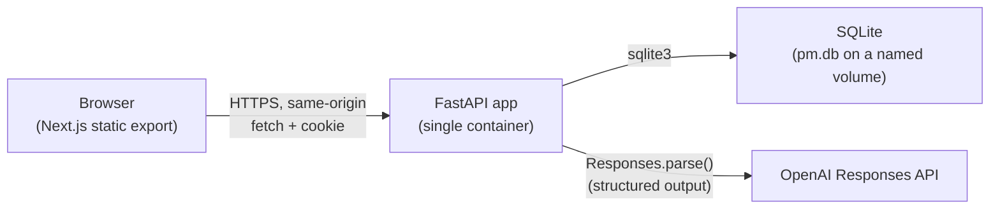
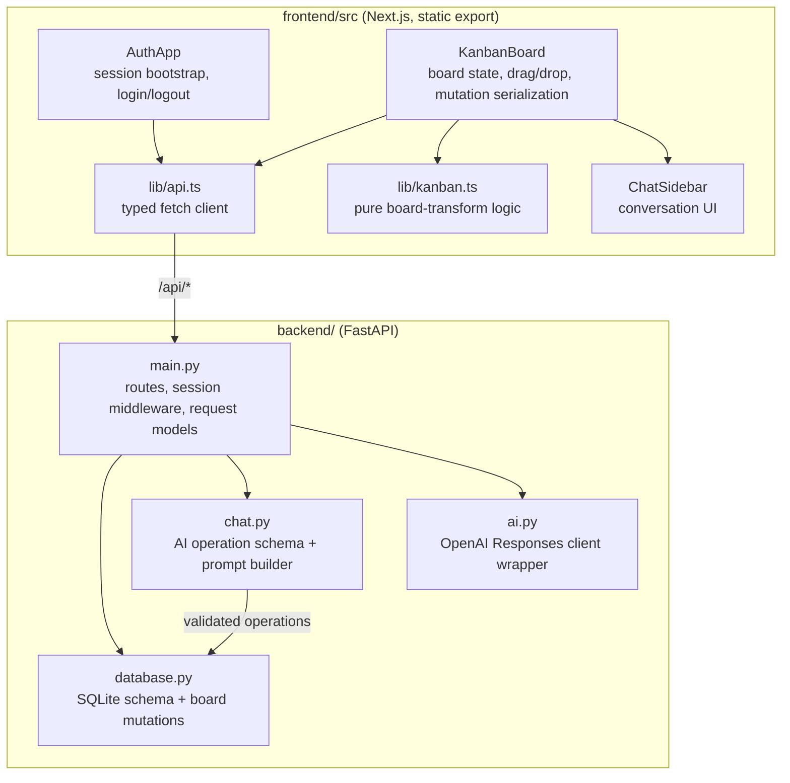
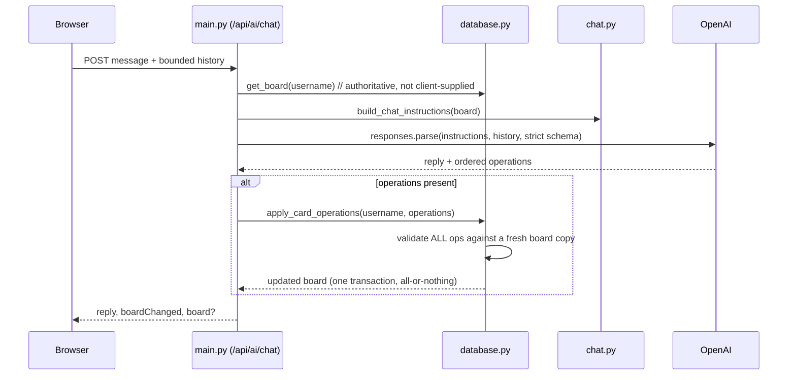
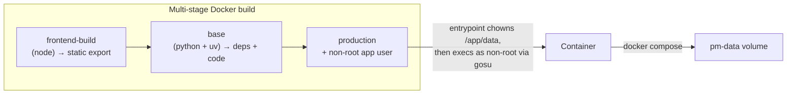

# High-level design

Project Management MVP: a single-user Kanban board with an AI chat assistant that can act on the board, packaged as one Docker container.

## Purpose and scope

A local, single-board Kanban tool. A signed-in user organizes work across five fixed columns and can also drive changes through natural-language chat with an AI assistant. Scope is deliberately narrow (see `README.md` / `AGENTS.md`): one hardcoded user, one board, local-only auth, SQLite storage, everything served from one container. The data model retains per-user ownership so multi-user support is a natural extension later, without that being built now.

## System context

One container serves both the UI and the API on `http://localhost:8000`. There is no separate frontend server at runtime — Next.js is built to static HTML/JS/CSS at image-build time and served by FastAPI.

## Component breakdown

### Frontend

- **Stack**: Next.js 16 (App Router) exported via `output: "export"` — no Next.js server at runtime — React 19, TypeScript strict, Tailwind CSS 4, `@dnd-kit` for drag-and-drop.
- **State model**: no global store. `AuthApp` owns session state; `KanbanBoard` owns board/chat state. Every mutation follows the same pattern: apply optimistically where cheap (drag reorder), send the request, and **replace visible state with the server's canonical response** — the UI never trusts its own optimistic state as final.
- **Data-fetching pattern**: a setState-free async function (`fetchBoardResult` / `fetchSessionResult`) classifies the outcome (success / unauthorized / error); a separate `applyBoardResult` / `applySessionResult` applies it to state. This keeps the mount effect and the manual "Try again" retry path sharing one code path instead of two independent ones.
- **Pure logic isolation**: `lib/kanban.ts` holds board types and drag-destination math with no React or fetch dependency, so it's unit-testable in isolation and reusable by both components and tests.

### Backend

- **`main.py`** — the FastAPI app factory. Wires two mounted sub-apps: an `api` app (all `/api/*` routes) and a static file mount at `/` serving the exported frontend. One `@application.middleware("http")` gates every `/api/board*` and `/api/ai*` request on a valid session; routes themselves just resolve the authenticated username, never re-checking auth.
- **`database.py`** — all SQLite access. Every board-mutating function re-derives the board from the authenticated `username` (never a client-supplied ID) and commits one transaction per call. Card ordering uses a stage-to-a-high-range-then-reassign technique so same-column reorders and cross-column moves can't collide with the `(board_id, column_id, position)` unique constraint mid-update.
- **`ai.py`** — a thin, swappable wrapper around the OpenAI Responses API (`AIService`). Tests inject a fake client; the real client is only constructed from environment config at request time, and provider errors are sanitized before they reach the client.
- **`chat.py`** — the contract for AI-issued board changes: a strict Structured Outputs schema (`create_card` / `edit_card` / `move_card` only, no delete, no column changes) and the system-prompt builder that serializes the full authoritative board into the prompt.

### Database

Four SQLite tables — `users`, `boards` (one per user), `columns` (five fixed IDs/positions, editable titles only), `cards` (ordered per column). Full schema and invariants: `docs/DATABASE_DESIGN.md` / `docs/database-schema.json`. Foreign keys are enforced (`PRAGMA foreign_keys = ON`), connections use a 10s busy timeout with WAL journaling, and the file lives at `/app/data/pm.db` on the `pm-data` named volume so it survives container restarts but not volume deletion.

## Request flow: AI chat turn

The model never receives or returns a raw board snapshot from the client, and a single invalid operation in a batch rolls back the entire batch — no partial AI edits are possible.

## Cross-cutting concerns

- **Auth**: hardcoded MVP credentials (`user`/`password`), opaque bearer tokens in an HTTP-only, `SameSite=Lax` cookie, held in an in-memory `active_sessions` dict keyed by token → `(username, expires_at)`. Sessions are checked and lazily expired on every request; there's no database-backed session store, so a restart clears all sessions. Not production identity management by design.
- **Validation boundary**: every card/column title and details field is length-bounded (`MAX_CARD_TITLE_LENGTH` / `MAX_CARD_DETAILS_LENGTH` in `chat.py`), enforced identically whether the write comes from a manual API call or an AI-issued operation, and mirrored as `maxLength` on the corresponding frontend inputs.
- **Failure handling**: FastAPI exception handlers translate every domain error (`BoardNotFoundError`, `ColumnNotFoundError`, `CardNotFoundError`, `InvalidMoveError`, `sqlite3.OperationalError`) into a small, consistent JSON `{"detail": ...}` shape — no stack traces, provider errors, or SQL details ever reach the client.
- **Testing strategy**: backend uses FastAPI's `TestClient` against a temporary SQLite file per test, with a fake `AIService` standing in for OpenAI in all but one explicitly opt-in, billable live test. Frontend uses Vitest/Testing Library for component logic and Playwright (with a mocked `/api/**` router) for full user-journey coverage; both run without hitting a live backend or OpenAI.

## Deployment

One image, three build targets: `test` (adds dev deps + `docs/`, runs pytest), `production` (the shipped image). The production stage creates a non-root `app` user; a small entrypoint script (`scripts/docker-entrypoint.sh`) runs briefly as root to `chown` the mounted data directory — needed because a pre-existing named volume from an earlier root-run container would otherwise be unwritable — then drops to `app` via `gosu` before starting uvicorn. Platform-specific `scripts/start.{ps1,sh}` / `stop.{ps1,sh}` wrap `docker compose` so the same one-container setup starts identically on Windows, macOS, and Linux.

## Key design decisions

| Decision | Why |
|---|---|
| Static export + single container | No separate Node runtime in production; one process, one port, simplest possible local deployment. |
| Server always re-fetches the board (chat and mutations alike) | A client-supplied board/user/board ID is never trusted — removes an entire class of tampering and staleness bugs. |
| AI restricted to 3 operation types, validated against a fresh board copy before any write | Bounds what a model can do structurally (schema) and behaviorally (validation), not just by prompting. |
| SQLite over a client/server database | Matches the single-user, single-container MVP scope; `sqlite3` + short-lived connections need no ORM or async layer. |
| Fixed five columns, only titles editable | Business requirement — the whole point of "one board" is a stable shape the AI and user share a mental model of. |

## Known limitations (by design, for this MVP)

- Single hardcoded user/board; auth is not production-grade.
- Sessions and chat history live only in process/browser memory — a restart or reload clears them.
- No horizontal scaling story: one SQLite file, one container, local use only.

See `docs/PLAN.md` for how this was built incrementally (10 approved parts) and `docs/code_review.md` for a post-completion review and remediation of the finished MVP.
