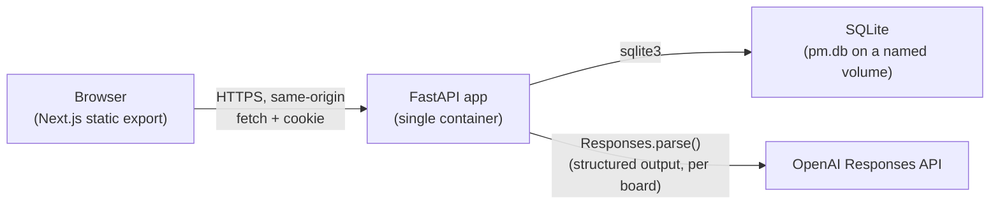
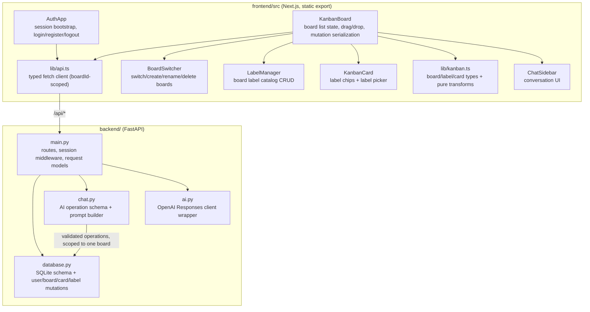
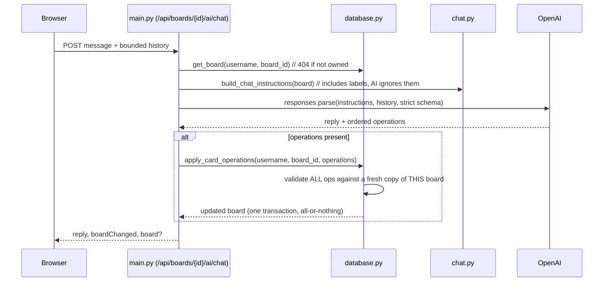
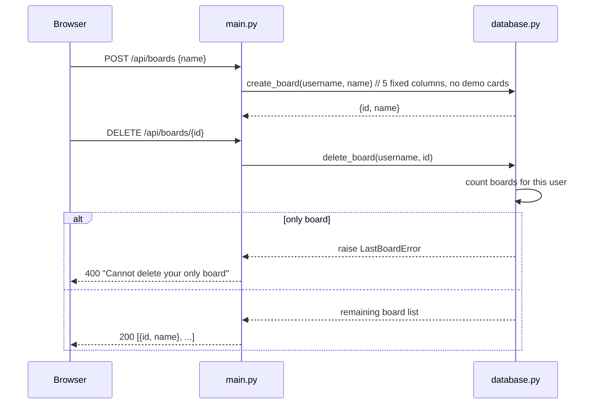

# High-level design — Ralph loop update (Parts 11-13)

This document describes the system after the Ralph-loop iteration that added
real user accounts, multiple boards per user, and card labels on top of the
completed 10-part MVP described in `docs/hld_design.md`. Read that document
first for the original single-user/single-board design; this one only covers
what changed and why.

## Purpose and scope

The MVP grew from "one hardcoded user, one board" to "any number of
self-registered users, each owning any number of named boards," plus a
lightweight per-board labeling system for cards. Everything else from the
original design is unchanged: one Docker container, FastAPI serving a static
Next.js export, SQLite storage, an AI chat assistant restricted to
create/edit/move-card operations.

- **Part 11 — Real user accounts.** Registration and DB-backed login replace
  the hardcoded `user`/`password` check.
- **Part 12 — Multiple boards per user.** A user can create, rename, switch
  between, and delete boards instead of owning exactly one.
- **Part 13 — Card labels.** A per-board catalog of colored labels that can be
  assigned to and removed from cards.

## System context

Unchanged from the original design: one container, one port, no separate
frontend server at runtime.

## Component breakdown

### Frontend changes

- **`AuthApp` / `LoginForm`**: gained a `mode` toggle (`"login" | "register"`)
  on one shared form component. Registering calls `sessionApi.register` and,
  on success, signs the user straight in — no separate confirmation step.
- **`KanbanBoard`**: now owns two layers of state instead of one — the user's
  `boards` list (`BoardSummary[]`) and the currently selected board's full
  `BoardData`. Mount does two sequential fetches (`boardsApi.list()` then
  `boardApi.get(firstBoardId)`); switching boards re-fetches only the second.
  Every mutation call (`renameColumn`, `createCard`, `moveCard`, chat, label
  ops) now threads the selected `boardId` through to `lib/api.ts`.
- **`BoardSwitcher`** (new): a `<select>` bound to the board list plus
  inline rename/create forms and a delete button. Delete is guarded
  client-side (disabled when only one board remains) and server-side
  (`LastBoardError` → 400); it uses a native `window.confirm` before firing,
  matching the app's plain-HTML-first UI style.
- **`LabelManager`** (new): board-scoped label catalog — create with a name
  and one of six fixed swatch colors, click a chip to rename/recolor inline,
  `×` to delete.
- **`KanbanCard`**: renders assigned label chips above the title and adds a
  small tag-icon button that opens a checkbox menu (one row per board label)
  wired to `onToggleLabel`, which computes the next `labelIds` array and
  calls `boardApi.setCardLabels` — a full-replace PUT, not an add/remove pair.

### Backend changes

- **`database.py`**:
  - `users` gained `password_hash`; `hash_password`/`verify_password` use
    stdlib `hashlib.pbkdf2_hmac` (260k iterations, random 16-byte salt) so no
    new dependency was needed. `register_user` inserts and lets the
    `uq_users_username` constraint raise `UsernameTakenError` on conflict
    (no separate check-then-insert race). `verify_login` looks up the hash
    and compares with `hmac.compare_digest`.
  - `boards.user_id` **lost** its `UNIQUE` constraint and gained a `name`
    column. Every board-scoped function now takes `board_id` and resolves it
    through `_resolve_board_id(connection, username, board_id)` — a single
    query that both looks up and authorizes in one step, raising
    `BoardNotFoundError` for a missing *or* not-owned ID (indistinguishable
    to the caller, so board IDs can't be enumerated).
  - Two new tables: `labels` (`board_id, id, name, color`, PK
    `(board_id, id)`) and `card_labels` (join table, PK
    `(board_id, card_id, label_id)`, both FKs `ON DELETE CASCADE`). A card's
    `labelIds` and a board's `labels` catalog are attached in `_read_board`
    alongside the existing columns/cards shape.
  - New `LastBoardError` (raised by `delete_board` when it's the user's only
    board) and `LabelNotFoundError`.
- **`main.py`**: routes moved from a single implicit board
  (`/api/board/...`) to `/api/boards/{board_id}/...` for every column/card/
  label/chat operation, plus `/api/boards` (list/create) and
  `/api/boards/{board_id}` (get/rename/delete). The auth middleware's
  protected-path check collapsed from two prefixes (`/api/board`, `/api/ai`)
  to one (`/api/boards`), since chat now lives under it too. `POST
  /auth/register` mirrors `/auth/login`'s session-cookie flow.

### Database

Six SQLite tables now: `users` (+ `password_hash`), `boards` (+ `name`, no
longer unique per user), `columns`, `cards` (unchanged), `labels`,
`card_labels`. Full schema: `backend/database.py` (source of truth),
`docs/database-schema.json` (machine-readable, version 2),
`docs/DATABASE_DESIGN.md` (narrative, with a Parts-11-13 addendum at the top).

## Request flow: board-scoped AI chat turn

The only change from the original flow is that every step is now scoped to
one `board_id`, verified against the session's username before any read.
Labels are not part of the AI's operation vocabulary in this iteration — the
model can see them (they're in the serialized board JSON) but has no
operation type to change them, enforced the same way delete/column changes
are blocked: the Structured Outputs schema simply has no such variant.

## Request flow: board lifecycle

## Cross-cutting concerns (what changed)

- **Auth**: no longer a hardcoded string comparison — `verify_login` is a DB
  lookup against a salted hash. The seeded demo account (`user`/`password`)
  still exists (created by `initialize_database`, demo cards included) so the
  documented quick-start credentials keep working; every other account is
  self-registered with an empty starter board (fixed columns, no demo cards).
  Session mechanics (opaque in-memory token, HTTP-only cookie) are unchanged.
- **Ownership boundary**: previously "resolve the one board for this
  username"; now "resolve *this* `board_id` for this username, or 404." This
  is the one invariant every new route depends on — it's centralized in
  `_resolve_board_id` rather than repeated per route.
- **Validation boundary**: extended to board names and label
  names/colors, using the same `Annotated[str, StringConstraints(...)]`
  pattern as card titles/details, enforced identically on manual and (for
  cards) AI-issued writes.
- **Testing strategy**: unchanged tools (pytest + `TestClient`, Vitest +
  Testing Library, Playwright with a mocked `/api/**` router), extended
  coverage — cross-user board/label 404s, last-board-deletion guard,
  duplicate-username registration, label CRUD and card assignment, and a
  full manual production-container smoke test (register → create board →
  switch boards → create/assign/remove a label) run against the real FastAPI
  app in Chrome.

## Key design decisions (new)

| Decision | Why |
|---|---|
| `_resolve_board_id` returns 404 for both "doesn't exist" and "not yours" | Prevents board-ID enumeration; matches the existing username-scoping pattern rather than inventing a new 403 path. |
| Password hashing via stdlib `hashlib.pbkdf2_hmac`, not a new dependency | Consistent with "keep it simple" — a project-root `pyproject.toml` dependency wasn't justified for one hash function. |
| `set_card_labels` replaces the full label set (PUT), not add/remove endpoints | One code path, one validation pass (all label IDs must belong to the board), no ordering-of-calls edge cases. |
| Newly created boards get fixed columns but no demo cards | Demo content belongs to the one seeded account; a user's own boards should start genuinely empty. |
| Labels are manual-only (no AI operation type) this iteration | Keeps the AI's validated vocabulary small and unambiguous; the Structured Outputs schema has no label variant, so it's a structural guarantee, not a prompt request. |
| No DB migration path | Pre-release local MVP with no production data; schema changes are shipped as a new `SCHEMA_STATEMENTS` set, and a stale local `pm-data` volume is expected to be reset (see `docs/PLAN.md` Part 11-13 checklists). |

## Known limitations (by design, for this iteration)

- Still no DB schema migrations — a volume created before Part 11 must be
  reset (`docker compose down -v`) before the new code will start against it.
- Labels are manual-only; the AI assistant cannot create, assign, or remove
  them yet.
- Sessions and chat history still live only in process/browser memory.
- No board sharing/collaboration — boards remain single-owner.

See `docs/PLAN.md` Parts 11-13 for the incremental checklist this was built
against, and `docs/hld_design.md` for everything that didn't change.
